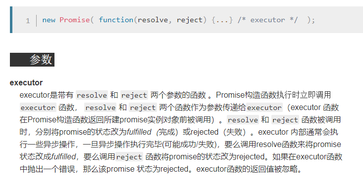

# 对着Promise/A+规范手写Promise, 附带完整测试用例

## Promise/A+规范原版和翻译版链接

[英文原版](https://promisesaplus.com/)
[中文翻译版](https://juejin.im/post/5b6161e6f265da0f8145fb72#heading-1)
有些翻译的不好的地方我在文中都做了解释

## 基础框架



根据MDN, 构造函数里传的函数应当立即执行, 同时Promise需要一个value来作为自己的值

```javascript
class Promise {
  constructor(fn) {
    if (typeof fn !== 'function') {
      throw new Error('构造函数里必须传一个函数')
      return
    }
    fn(this.resolve, this.reject)
  }

  resolve() {}

  reject() {}
}
```

然后就开始跟着Promise/A+规范写啦

## 2.1 Promise状态

一个promise必须处于三种状态之一： 请求态（pending）， 完成态（fulfilled），拒绝态（rejected）

```diff
class Promise {
+ state = 'pending'

  constructor(fn) {
  	this.state = 'pending'
    if (typeof fn !== 'function') {
      throw new Error('构造函数里必须传一个函数')
      return
    }
    fn(this.resolve, this.reject)
  }

  resolve() {}

  reject() {}
}
```

## 2.2 `then`方法

promise必须提供`then`方法来存取它当前或最终的值或者原因。
promise的`then`方法接收两个参数：
> promise.then(onFulfilled, onRejected)

### 2.2.1 `onFulfilled`和`onRejected`都是可选的参数:

- 2.2.1.1 如果`onFulfilled`不是函数，必须忽略
- 2.2.1.1 如果`onRejected`不是函数，必须忽略

```diff
class Promise {
  state = 'pending'

  constructor(fn) {
    if (typeof fn !== 'function') {
      throw new Error('构造函数里必须传一个函数')
      return
    }
    fn(this.resolve, this.reject)
  }

  resolve() {}

  reject() {}

+ then(onFulfilled, onRejected) {
+   if (typeof onFulfilled === 'function') {
+   }
+   if (typeof onRejected === 'function') {
+   }
+ }
}
```

### 2.2.2 如果`onFulfilled`是函数

- 2.2.2.1 此函数必须在`promise`完成(fulfilled)后被调用,并把`promise`的值作为它的第一个参数
- 2.2.2.2 此函数在`promise`完成(fulfilled)之前绝对不能被调用
- 2.2.2.2 此函数绝对不能被调用超过一次

### 2.2.3 如果`onRejected`是函数

- 2.2.2.1 此函数必须在promise rejected后被调用,并把promise 的reason作为它的第一个参数
- 2.2.2.2 此函数在promise rejected之前绝对不能被调用
- 2.2.2.2 此函数绝对不能被调用超过一次

### 2.2.4 在执行上下文堆栈（execution context）仅包含平台代码之前，不得调用`onFulfilled`和`onRejected`

这句话大致的意思就是同步代码执行完之前不得调用`onFulfilled`或`onRejected`

```javascript
function nextTick(fn) {
  if (process && process.nextTick) {
    process.nextTick(fn)
  } else {
    queueMicrotask(fn)
  }
}

class Promise {
  state = 'pending'
  onFulfilled = null
  onRejected = null

  constructor(fn) {
    if (typeof fn !== 'function') {
      throw new Error('构造函数里必须传一个函数')
      return
    }
    // 不绑定 this 的话, 那么用户在 resolve(2333) 的时候里面的 this 就是 window 了
    fn(this.resolve.bind(this), this.reject.bind(this))
  }

  resolve(result) {
    if (this.state !== 'pending') { return } // 保证了只调用一次onFulfilled
    this.state = 'fulfilled'
    // 保证了在 resolve 以及同步代码之后调用
    nextTick(() => {
      if (typeof this.onFulfilled === 'function') {
        this.onFulfilled(result)
      }
    })
  }

  reject(reason) {
    if (this.state !== 'pending') { return } // 保证了只调用一次onRejected
    this.state = 'rejected'
    // 保证了在 reject 以及同步代码之后调用
    nextTick(() => {
      if (typeof this.onRejected === 'function') {
        this.onRejected(reason)
      }
    })
  }

  then(onFulfilled, onRejected) {
    if (typeof onFulfilled === 'function') {
      this.onFulfilled = onFulfilled
    }
    if (typeof onRejected === 'function') {
      this.onRejected
    }
  }
}
```

### 2.2.5 `onFulfilled`和`onRejected`必须被当做函数调用(比如不能有`this`值)

```diff
resolve(result) {
  if (this.state !== 'pending') { return } // 保证了只调用一次onFulfilled
  this.state = 'fulfilled'
  // 保证了在 resolve 以及同步代码之后调用
  nextTick(() => {
    if (typeof this.onFulfilled === 'function') {
-      this.onFulfilled(result)
+      this.onFulfilled.call(undefined, result)
    }
  })
}

reject(reason) {
  if (this.state !== 'pending') { return } // 保证了只调用一次onRejected
  this.state = 'rejected'
  // 保证了在 reject 以及同步代码之后调用
  nextTick(() => {
    if (typeof this.onRejected === 'function') {
-      this.onRejected(reason)
+      this.onRejected.call(undefined, reason)
    }
  })
}
```

### 2.2.6 `then`可以在同一个promise里被多次调用

- 2.2.6.1 如果/当 promise 完成执行（fulfilled）,各个相应的onFulfilled回调必须根据最原始的then 顺序来调用
- 2.2.6.2 如果/当 promise 被拒绝（rejected）,各个相应的onRejected回调必须根据最原始的then 顺序来调用

这句话的意思是可能出现这样的代码

```javascript
const promise = new Promise((resolve, reject) => {
  resolve(2333)
})
promise.then(val => console.log(val))
promise.then(val => console.log(val + 1))
promise.then(val => console.log(val + 2))
// 会依次打印出2333, 2334, 2335
```

这时候我们之前写的代码就不行了, 之前的代码一个promise实例里只有一个`onFulfilled`和一个`onRejected`, 现在很明显需要两个数组来存`onFulfilled`和`onRejected`了

```diff
resolve(result) {
    if (this.state !== 'pending') { return } // 保证了只调用一次onFulfilled
    this.state = 'fulfilled'
    // 保证了在 resolve 以及同步代码之后调用
    nextTick(() => {
+      this.onFulfilled.forEach(resolveHandler => {
+        resolveHandler.call(undefined, result)
+      })
-      if (typeof this.onFulfilled === 'function') {
-         this.onFulfilled.call(undefined, result)
-      }
    })
  }
reject(reason) {
    if (this.state !== 'pending') { return } // 保证了只调用一次onRejected
    this.state = 'rejected'
    // 保证了在 reject 以及同步代码之后调用
    nextTick(() => {
+      this.onRejected.forEach(rejectHandler => {
+        rejectHandler.call(undefined, reason)
+      })
-      if (typeof this.onRejected === 'function') {
-        this.onRejected.call(undefined, reason)
-      }
    })
  }
then(onFulfilled, onRejected) {
  if (typeof onFulfilled === 'function') {
-    this.onFulfilled = onFulfilled
+    this.onFulfilled.push(onFulfilled)
  }
  if (typeof onRejected === 'function') {
-    this.onRejected = onRejected
+    this.onRejected.push(onRejected)
  }
}
```

### 2.2.7 `then`必须返回一个promise

#### 2.2.7.1 如果`onFulfilled`或`onRejected`返回一个值`x`, 运行 Promise Resolution Procedure `[[Resolve]](promise2, x)`

这一段的内容标准里跳到了2.3=

## 2.3 Promise解决程序

### 2.3.1 如果`promise`和`x`引用同一个对象，则用TypeError作为原因拒绝（reject）`promise`

