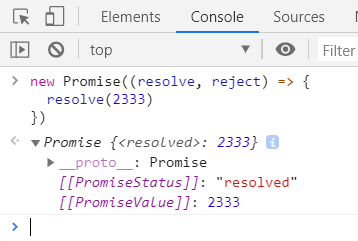

# 对着 Promise/A+规范手写 Promise, 附带完整测试用例

## Promise/A+规范原版和翻译版链接

[英文原版](https://promisesaplus.com/)
[中文翻译版](https://juejin.im/post/5b6161e6f265da0f8145fb72#heading-1)
有些翻译的不好的地方我在文中都做了解释

## 基础框架

### executor 立即执行


根据 MDN, 构造函数里传的函数应当立即执行.

### 具有属性`status`和`value`


且`status`只能是`pending`, `fulfilled`, `rejected` 三种
`status`属性在规范里叫`state`

### 基础框架代码

```javascript
class Promise {
  constructor(fn) {
    this.state = 'pending'
    this.value = undefined
    if (typeof fn !== 'function') {
      throw new Error('构造函数里必须传一个函数')
      return
    }
    // 绑定 this, 这样用户在调用 resolve 和 reject 的时候, 这俩函数体内 this 依然是这个 promise 对象
    fn(this.resolve.bind(this), this.reject.bind(this))
  }

  resolve() {}

  reject() {}
}
```

然后就开始跟着 Promise/A+规范写啦

## 2.2 `then`方法

promise 必须提供`then`方法来存取它当前或最终的值或者原因。
promise 的`then`方法接收两个参数:

```diff
class Promise {
  constructor(fn) {
    this.state = 'pending'
    this.value = undefined
    if (typeof fn !== 'function') {
      throw new Error('构造函数里必须传一个函数')
      return
    }
    // 绑定 this, 这样用户在调用 resolve 和 reject 的时候, 这俩函数体内 this 依然是这个 promise 对象
    fn(this.resolve.bind(this), this.reject.bind(this))
  }

  resolve() {}

  reject() {}

+ then(onFulfilled, onRejected) {}
}
```

### 2.2.1 `onFulfilled`和`onRejected`都是可选的参数

- 2.2.1.1 如果`onFulfilled`不是函数，必须忽略
- 2.2.1.2 如果`onRejected`不是函数，必须忽略

### 2.2.2 如果`onFulfilled`是函数

- 2.2.2.1 此函数必须在`promise`完成(fulfilled)后被调用,并把`promise`的值作为它的第一个参数
- 2.2.2.2 此函数在`promise`完成(fulfilled)之前绝对不能被调用
- 2.2.2.3 此函数绝对不能被调用超过一次

### 2.2.3 如果`onRejected`是函数

- 2.2.3.1 此函数必须在 promise rejected 后被调用,并把 promise 的 reason 作为它的第一个参数
- 2.2.3.2 此函数在 promise rejected 之前绝对不能被调用
- 2.2.3.3 此函数绝对不能被调用超过一次

### 2.2.4 在执行上下文堆栈（execution context）仅包含平台代码之前，不得调用`onFulfilled`和`onRejected`

这句话大致的意思就是同步代码执行完之前不得调用`onFulfilled`或`onRejected`

### 2.2.5 `onFulfilled`和`onRejected`必须被当做函数调用(比如不能有`this`值)

因为异步调用的原因, 所以我们需要写一个工具函数来帮助我们异步执行函数

```javascript
function nextTick(fn) {
  if (process && process.nextTick) {
    process.nextTick(fn) // 兼容 node
  } else {
    /*
    为了简化理解, 就不考虑兼容性, 直接用最新的 API
    顾名思义, 就是把 fn 加入微队列
    */
    queueMicrotask(fn) // 兼容浏览器
  }
}
```

```javascript
class Promise {
  constructor(fn) {
    this.state = 'pending'
    this.onFulfilled = null // then 进来的函数存储在这里, 不存储起来怎么异步调用呢
    this.onRejected = null // 同上
    if (typeof fn !== 'function') {
      throw new Error('构造函数里必须传一个函数')
      return
    }
    // 不绑定 this 的话, 那么用户在 resolve(2333) 的时候里面的 this 就是 window 了
    fn(this.resolve.bind(this), this.reject.bind(this))
  }

  resolve(result) {
    // 2.1.2.2 已经是fulfilled状态, value就不能改了, 直接 return
    if (this.state !== 'pending') {
      return
    } // 保证了只调用一次onFulfilled
    this.state = 'fulfilled'
    // 2.1.2.2
    this.value = result
    // 2.2.4 保证了异步调用 2.2.2
    nextTick(() => {
      // 2.2.1.1
      if (typeof this.onFulfilled === 'function') {
        // 2.2.5 this 是 undefined
        this.onFulfilled.call(undefined, result)
      }
    })
  }

  reject(reason) {
    // 2.1.2.2 已经是rejected状态, value就不能改了, 直接 return
    if (this.state !== 'pending') {
      return
    }
    this.state = 'rejected'
    // 2.1.2.2
    this.value = reason
    // 2.2.4 保证了异步调用 2.2.3
    nextTick(() => {
      // 2.2.1.2
      if (typeof this.onRejected === 'function') {
        // 2.2.5 this 是 undefined
        this.onRejected.call(undefined, reason)
      }
    })
  }

  then(onFulfilled, onRejected) {
    this.onFulfilled = onFulfilled
    this.onRejected = onRejected
  }
}
```

写到这里, `Promise`的雏形就出来了.
原理大致就是**_`then`把传进来的回调函数放进`promise`里保存起来, 然后通过`resolve`和`reject`调用刚刚保存起来的函数_**
接下来都是基于此原理
所以,当我们写出如下 code

```javascript
new Promise((resolve, reject) => {
  setTimeout(() => {
    resolve(2333)
  }, 5000)
}).then((num) => {
  console.log(num)
})
console.log('hello world')
```

看到`new Promise`先执行里面的函数, 得知 5s 后 resolve, ok. 然后执行`then`, 仅仅是把打印`num`的函数**_存起来_**, 然后执行打印 hello world. 最后过了 5s 终于`resolve`了, 于是执行存起来的那个函数, 也就是打印出 2333

### 2.2.6 `then`可以在同一个 promise 里被多次调用

- 2.2.6.1 如果/当 promise 完成执行（fulfilled）,各个相应的 onFulfilled 回调必须根据最原始的 then 顺序来调用
- 2.2.6.2 如果/当 promise 被拒绝（rejected）,各个相应的 onRejected 回调必须根据最原始的 then 顺序来调用

这句话的意思是可能出现这样的代码

```javascript
const promise = new Promise((resolve, reject) => {
  resolve(2333)
})
promise.then((val) => console.log(val))
promise.then((val) => console.log(val + 1))
promise.then((val) => console.log(val + 2))
// 会依次打印出2333, 2334, 2335
```

这时候我们之前写的代码就不行了, 之前的代码一个 promise 实例里只有一个`onFulfilled`和一个`onRejected`, 现在很明显需要数组了

### 2.2.7 `then`必须返回一个 promise

意思是当我们写出如下代码

```javascript
new Promise((resolve) => {
  resolve(2333)
}).then((num) => {
  console.log(num)
}) // .then(...)
```

这个`then`很厉害, 传进来两个函数我们要存起来, 自己还要返回一个`promise`, 供接下来链式调用. 那为何我们不用一个对象把这三个存起来呢, 又因为一个`promise`可能对应多个`then`, 所以就是一个对象数组啦.

#### 2.2.7.1 如果`onFulfilled`或`onRejected`返回一个值`x`, 运行 Promise Resolution Procedure `[[Resolve]](promise2, x)`

```javascript
class Promise {
  constructor(fn) {
    this.state = 'pending'
    /* 不够用了, 要换成数组
    this.onFulfilled = null
    this.onRejected = null
    */
    // [{onFulfilled, onRejected, nextPromise}, {onFulfilled, onRejected, nextPromise}]
    // 2.2.6
    this.on = []
    this.value = undefined
    if (typeof fn !== 'function') {
      throw new Error('构造函数里必须传一个函数')
      return
    }
    fn(this.resolve.bind(this), this.reject.bind(this))
  }

  resolve(result) {
    if (this.state !== 'pending') {
      return
    } // 保证了只调用一次onFulfilled
    this.state = 'fulfilled'
    this.value = result
    /*
-    nextTick(() => {
-      if (typeof this.onFulfilled === 'function') {
-        this.onFulfilled.call(undefined, result)
-      }
-    })
    */
    nextTick(() => {
      // 2.2.6.1
      this.on.forEach(({ onFulfilled, onRejected, nextPromise }) => {
        if (typeof onFulfilled === 'function') {
          if (onFulfilled.called) {
            return
          }
          onFulfilled.called = true
          let x
          x = onFulfilled.call(undefined, this.value)
          // 2.2.7.1
          nextPromise.resolveWith(x) // promise解决程序就是 resolveWith, 这个命名方便以后重构
        }
      })
    })
  }

  reject(reason) {
    if (this.state !== 'pending') {
      return
    }
    this.state = 'rejected'
    this.value = reason
    /*
-    nextTick(() => {
-      if (typeof this.onRejected === 'function') {
-        this.onRejected.call(undefined, reason)
-      }
-    })
    */
    nextTick(() => {
      // 2.2.6.2
      this.on.forEach(({ onFulfilled, onRejected, nextPromise }) => {
        if (typeof onRejected === 'function') {
          let x
          // x 就是第一个 then 里 return 的值
          x = onRejected.call(undefined, this.value)
          // 2.2.7.1
          nextPromise.resolveWith(x) // promise解决程序就是 resolveWith, 这个命名方便以后重构
        }
      })
    })
  }

  then(onFulfilled, onRejected) {
    // 因为nextPromise的处理都在2.3的promise解决程序里了, 所以这个promise传一个空函数就好了
    const nextPromise = new Promise(() => {})
    this.on.push({
      onFulfilled,
      onRejected,
      nextPromise,
    })
    // 2.2.7
    return nextPromise
  }
}
```

然后就是 promise 解决程序啦, promise 解决程序在标准里跳到了 2.3

## 2.3 Promise 解决程序

promise 解析过程是一个抽象操作，它将 promise 和 value 作为输入，我们将其表示为`[[Resolve]](promise, x)`
如果`x`是 thenable 的，假设 x 的行为至少有点像`promise`, 它会尝试让`promise`采用`x`的状态, 不然就会用`x`来完成`promise`.

这段话的意思是, 假设有如下 code

```javascript
new Promise((resolve) => {
  resolve(2333)
})
  .then((num) => {
    return num + 1
  })
  .then((num) => {
    console.log(num) // 2444
  })
```

第一个`then`里函数的返回值应作为第二个`promise`的`value`供后面链式调用

由于这个解决程序都是繁文缛节, 我只在难以理解的标题下写上测试用例帮助大家理解, 完整的代码会放到后面并做好注释, 完整的测试用例见[完整测试用例](https://github.com)

### 2.3.1 如果`promise`和`x`引用同一个对象，则用 TypeError 作为原因拒绝（reject）`promise`

```javascript
const promise = new Promise((resolve) => resolve(2333))
assert.throw(() => {
  const promise2 = promise.then((num) => promise.then())
  done()
})
```

### 2.3.2 如果`x`是一个 promise,采用 promise 的状态

- 2.3.2.1 如果`x`是请求状态(pending), `promise`必须保持 pending 直到`x`fulfilled 或 rejected
- 2.3.2.2 如果`x`是完成态(fulfilled)，用相同的值完成 fulfill`promise`
- 2.3.2.3 如果`x`是拒绝态(rejected)，用相同的原因 reject`promise`

```javascript
const promise = new Promise((resolve) => {
  resolve()
})
const promise2 = promise.then(() => new Promise((resolve) => resolve(2333)))
promise2.then((num) => {
  assert(num === 2333)
  done()
})
```

### 2.3.3 另外, 如果`x`是个对象或者方法

- 2.3.3.1 让`x`作为`x.then`
- 2.3.3.2 如果取回的`x.then`属性的结果为一个异常`e`,用`e`作为原因 reject`promise`
- 2.3.3.3 如果`then`是一个方法，把`x`当作`this`来调用它， 第一个参数为 `resolvePromise`，第二个参数为`rejectPromise`, 其中:
  - 2.3.3.3.1 当`resolvePromise`被一个值`y`调用, 运行`[[Resolve]](promise, y)`
  - 2.3.3.3.2 当`rejectPromise`被一个原因`r`调用, 用`r`拒绝(reject)`promise`
  - 2.3.3.3.3 如果`resolvePromise`和`rejectPromise`都被调用, 或者对同一个参数进行多次调用，第一次调用执行，任何进一步的调用都被忽略
  - 2.3.3.3.4 如果调用`then`抛出一个异常`e`,
    - 2.3.3.3.4.1 如果`resolvePromise`或`rejectPromise`已被调用，忽略
    - 2.3.3.3.4.2 或者, 用`e`作为 reason 拒绝(reject)`promise`
- 2.3.3.4 如果`then`不是一个函数, 用`x`完成(fulfill)`promise`

```javascript
// 2.3.3.2
new Promise((resolve) => {
  resolve()
})
  .then(() => {
    const obj = {}
    Object.defineProperty(obj, 'then', {
      get() {
        throw new Error('xxx')
      },
    })
    return obj
  })
  .then(null, (err) => {
    assert((err.message = 'xxx'))
    done()
  })

// 2.3.3.3.1
class Thenable {
  constructor(num) {
    this.num = num
  }
  then(resolve, reject) {
    // 1 秒后使用 this.num*2 进行 resolve
    setTimeout(() => resolve(this.num * 2), 1000)
  }
}

new Promise((resolve) => resolve(1))
  .then((result) => {
    return new Thenable(result)
  })
  .then((num) => {
    assert(num === 2)
    done()
  })
```

### 2.3.4 如果`x`既不是对象也不是函数, 用`x`完成(fulfill)`promise`

至此 promise 解决程序就完了, promise/A+规范又跳回了 2.2.7.2

## 2.2 again

### 2.2.7 again

- 2.2.7.2 如果`onFulfilled`或`onRejected`抛出一个异常`e`, `promise2`必须被拒绝(rejected)并把`e`当作原因
- 2.2.7.3 如果`onFulfilled`不是一个方法, 并且`promise1`已经完成（fulfilled）, `promise2`必须使用与`promise1`相同的值来完成（fulfiled）
- 2.2.7.4 如果`onRejected`不是一个方法，并且`promise1`已经被拒绝（rejected）, `promise2`必须使用与`promise1`相同的原因来拒绝（rejected）

```javascript
// 2.2.7.4
new Promise((resolve, reject) => reject(2333)).then().then(null, (num) => {
  assert(num === 2333)
  done()
})
```

## promise 解决程序完整代码

```javascript
function nextTick(fn) {
  if (process && process.nextTick) {
    process.nextTick(fn) // nodejs
  } else {
    queueMicrotask(fn) // 浏览器
  }
}

class Promise {
  constructor(fn) {
    this.state = 'pending'
    // [{onFulfilled, onRejected, nextPromise}, {onFulfilled, onRejected, nextPromise}]
    this.on = []
    this.value = undefined
    if (typeof fn !== 'function') {
      throw new Error('构造函数里必须传一个函数')
      return
    }
    fn(this.resolve.bind(this), this.reject(this))
  }

  resolve(result) {
    // 2.2.2.3
    if (this.state !== 'pending') {
      return // 保证了只调用一次onFulfilled
    }
    this.value = result
    this.state = 'fulfilled'

    // 保证了在 resolve 以及同步代码之后调用
    // 2.2.2.2, 2.2.4
    nextTick(() => {
      // 2.2.6.1
      this.on.forEach(({ onFulfilled, onRejected, nextPromise }) => {
        // 2.2.1.1
        if (typeof onFulfilled === 'function') {
          let x
          try {
            // 2.2.2.1, 2.2.5
            x = onFulfilled.call(undefined, this.value)
          } catch (e) {
            // 2.2.7.2
            nextPromise.reject(e)
            return
          }
          // 2.2.7.1
          nextPromise.resolveWith(x)
        } else {
          // 2.2.7.3
          nextPromise.resolveWith(this.value)
        }
      })
    })
  }

  reject(reason) {
    // 2.2.3.3
    if (this.state !== 'pending') {
      return // 保证了只调用一次onRejected
    }
    this.value = reason
    this.state = 'rejected'
    // 保证了在 reject 以及同步代码之后调用
    // 2.2.3.2, 2.2.4
    nextTick(() => {
      // 2.2.6.2
      this.on.forEach(({ onFulfilled, onRejected, nextPromise }) => {
        // 2.2.1.2
        if (typeof onRejected === 'function') {
          let x
          try {
            // 2.2.3.1, 2.2.5
            x = onRejected.call(undefined, this.value)
          } catch (e) {
            // 2.2.7.2
            nextPromise.reject(e)
            return
          }
          // 2.2.7.1
          nextPromise.resolveWith(x)
        } else {
          // 2.2.7.4
          nextPromise.reject(this.value)
        }
      })
    })
  }

  then(onFulfilled, onRejected) {
    const nextPromise = new Promise(() => {})
    this.on.push({
      onFulfilled,
      onRejected,
      nextPromise,
    })
    return nextPromise
  }

  resolveWithSelf() {
    this.reject(new TypeError())
  }

  // 是 promise 的话就用resolve, 因为是promise的话一定有一个定下来的value
  resolveWithPromise(x) {
    // 2.3.2.1, 2.3.2.2, 2.3.2.3
    x.then(this.resolve.bind(this), this.reject.bind(this))
  }

  resolveWithThenable(x) {
    let wasCalled = false
    try {
      x.then(
        // 2.3.3.3.1
        function (y) {
          if (wasCalled) {
            return // 2.3.3.3.3
          }
          wasCalled = true
          this.resolveWith(y)
        }.bind(this),
        // 2.3.3.3.2
        function (r) {
          if (wasCalled) {
            return // 2.3.3.3.3
          }
          wasCalled = true
          this.reject(r)
        }.bind(this)
      )
    } catch (e) { // 2.3.3.3.4
      if (wasCalled) {
        return // 2.3.3.3.4.1
      }
      // 2.3.3.3.4.2
      this.reject(e)
    }
  }

  resolveWithObject(x) {
    let then
    try {
      // 2.3.3.1
      then = x.then
    } catch (e) {
      // 2.3.3.2
      this.reject(e)
      return
    }
    if (then instanceof Function) {
      // 2.3.3.3
      this.resolveWithThenable(x)
    } else {
      // 2.3.3.4
      this.resolve(x)
    }
  }
  resolveWith(x) {
    const nextPromise = this
    if (x === nextPromise) {
      // 2.3.1
      nextPromise.resolveWithSelf()
    } else if (x instanceof Promise) {
      // 2.3.2
      nextPromise.resolveWithPromise(x)
    } else if (x instanceof Object) {
      // 2.3.3
      nextPromise.resolveWithObject(x)
    } else {
      // 2.3.4
      nextPromise.resolve(x)
    }
  }

  static resolve(result) {
    return new Promise((resolve) => resolve(result))
  }

  static reject(reason) {
    return new Promise((resolve, reject) => reject(reason))
  }
}
```

## BONUS

### BONUS #1

有如下代码:

```javascript
const promise = new Promise((resolve, reject) => {
  resolve(Promise.resolve(Promise.resolve(2333)))
})
promise.then(num => {
  console.log(num) // 打印出2333
})
```

或者

```javascript
const promise = new Promise((resolve, reject) => {
  resolve(Promise.reject(Promise.resolve(2333)))
})
promise.then(null, innerPromise => {
  innerPromise.then(num => {
    console.log(num) // 打印出2333
  })
})
```

或者

```javascript
const promise1 = new Promise(resolve => {
  resolve(2333)
  throw new Error('xxx')
})
promise1.then(console.log) // 打印出2333

const promise1 = new Promise(() => {
  throw new Error('xxx')
})
promise1.then(null, e => {
  console.log(e.message) // 打印出xxx
})
```

fn(this.resolveWith.bind(this))

这一点我一开始也很困惑, 可以看我在stack overflow的提问
[resolve和reject在js的promise里究竟做了什么](https://stackoverflow.com/questions/60694924/what-does-resolve-and-reject-actually-do-in-javascript-promise/60696430#60696430)

一句话概括就是: `resolve`就表示你在做正确的事, 所以会帮你做一个promise解决程序; 而`reject`就表示你在把一个危险的东西传出去, 太危险了, 我不会帮你解决的(所以原封不动地传给下一个promise)

这里就不给代码了, 具体见我的[github](https://github.com/crazyones110/implement-promise)
这里给出思路, 就是`new Promise(resolve)`里传进去的`resolve`也要做一个promise解决程序

### BONUS #2

有如下代码:

```javascript
const promise = new Promise(resolve => resolve(2333))
queueMicrotask(() => {
  promise.then(console.log)
})
```


如图所示, 这个`console.log`根本不会执行!
解决的思路也不难想, 就是在`then`的时候也写一个`nextTick`来遍历执行onFulfilled. 但是会引入一个新的问题, 就是同一个`onFulfilled`可能会执行两次.
这时候有两种思路:

- 函数记忆化 *(我的代码采用此种方法)*
- `arr.splice(0).forEach()`

再思考, 如果`resolve`, `reject`, `then`的时候都执行`nextTick`遍历`onFulfilled`, 那是不是能把这个`nextTick`提取出来, 做为公共的函数呢. 答案是可以的, 这就是我们很熟悉的发布订阅模式啦~. 见如下代码:

```javascript

```

then里也要有一个nextTick, 那么可以优化成$emit
但是就引入了一个新的问题, onFulfilled可能会调用两次了, 有两种思路:
要么简单的函数记忆化, 要么 splice(0)

<https://www.promisejs.org/implementing/>
https://stackoverflow.com/questions/23772801/basic-javascript-promise-implementation-attempt/23785244#23785244